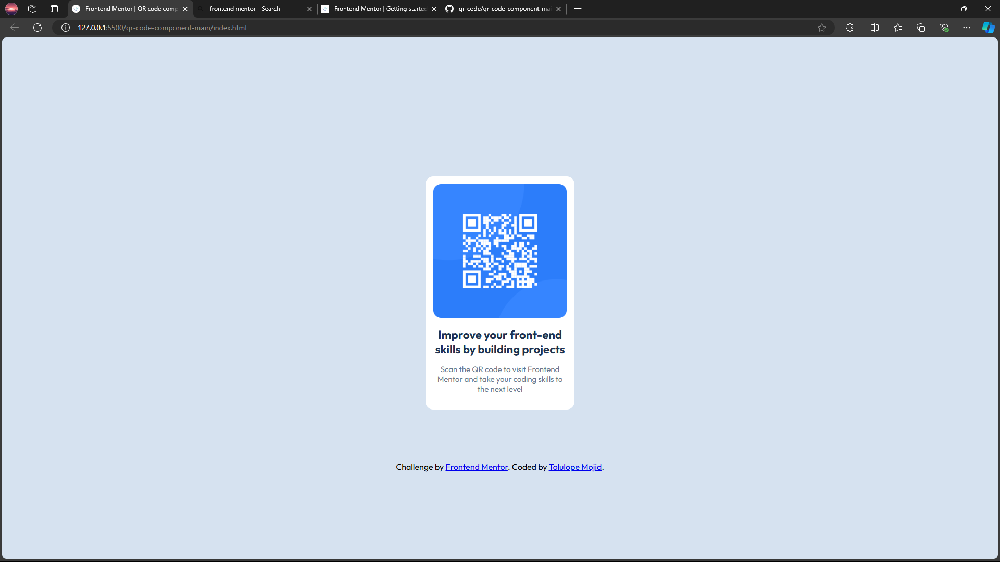

# Frontend Mentor - QR code component solution

This is a solution to the [QR code component challenge on Frontend Mentor](https://www.frontendmentor.io/challenges/qr-code-component-iux_sIO_H). Frontend Mentor challenges help you improve your coding skills by building realistic projects.

## Table of contents

-    [Overview](#overview)
     -    [Screenshot](#screenshot)
     -    [Links](#links)
-    [My process](#my-process)
     -    [Built with](#built-with)
     -    [What I learned](#what-i-learned)
-    [Author](#author)
-    [Acknowledgments](#acknowledgments)

**Note: Delete this note and update the table of contents based on what sections you keep.**

## Overview

### Screenshot



### Links

-    Live Site URL: [Add live site URL here](https://tomxyd.github.io/qr-code/)

## My process

### Built with

-    Semantic HTML5 markup
-    CSS custom properties
-    Flexbox
-    CSS Grid
-    Mobile-first workflow

### What I learned

I learnt how to define variables in css using :root selector

```css
:root {
     --var-name: value;
}
body {
     font-family: var(--var-name);
}
```

I also learnt that to center a block, you can either use the Flexbox method, or
use the margin auto, then set the size of the block by changing the values of
either height or width. It is good to note that by default before styling in css, you should set the html and body to a minimum height of 100vh or 100%.

```css
html,
body {
     min-height: 100vh / 100%;
}
```

In this project, I also had the opportunity to apply media queries but the basics.
Note: In responsive designs, it is best to use the mobile-first approach, because
most people use their phones to access a website first. To do this, you style for
phones first, then use a media query of min-width: 750px.

## Author

-    Frontend Mentor - [@yourusername](https://www.frontendmentor.io/profile/tomxyd)

## Acknowledgments

Jon Duckett - HTML & CSS (Helped with getting my foundations)
